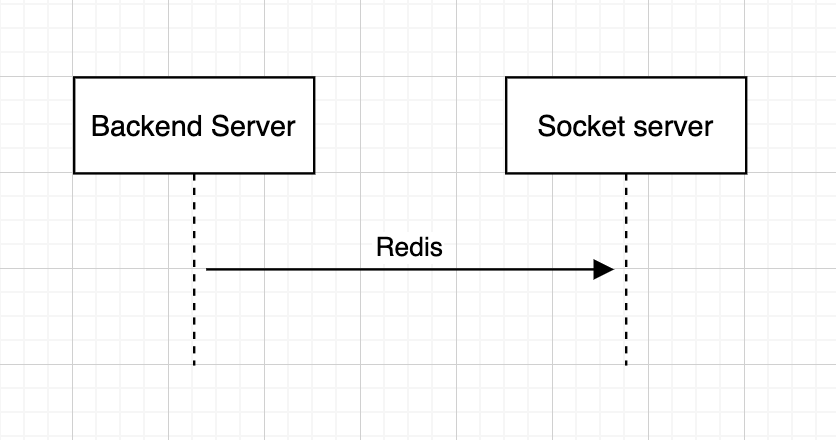

## Docker Compose for Laravel Echo Server
### Preparing
``` 
cp .env.example .env
docker-compose build
docker-compose up
```
### Checking

```
# Check docker containers are running
docker ps
# Access to container
docker exec -it [container_id] /bin/bash
```

### Connecting
- Local connect to Redis
    - Redis host: 10.10.10.2 
    - Redis port: {REDIS_PORT} in ENV
    
- Local connect to Echo server
    - Echo host: http://localhost:{ECHO_PORT}

- Echo server connect to Redis
    - Redis host: 10.10.10.2 
    - Redis port: 6379
### Flow


